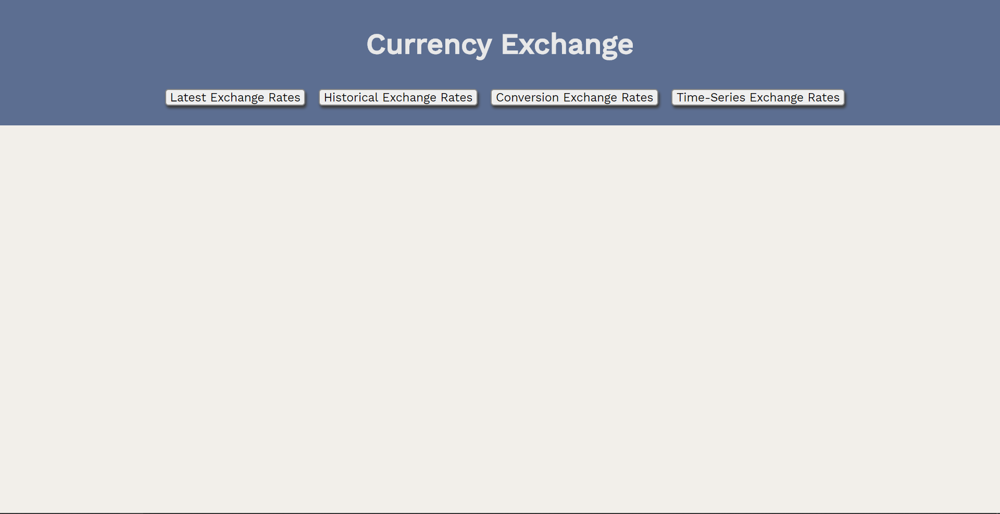
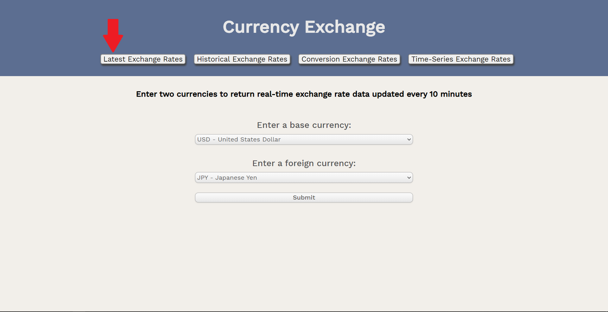
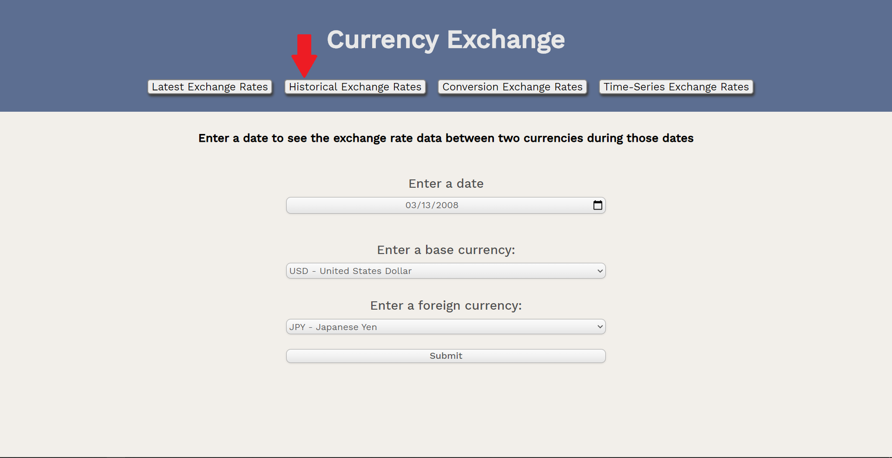
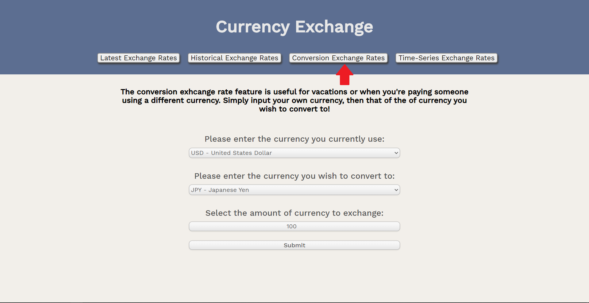
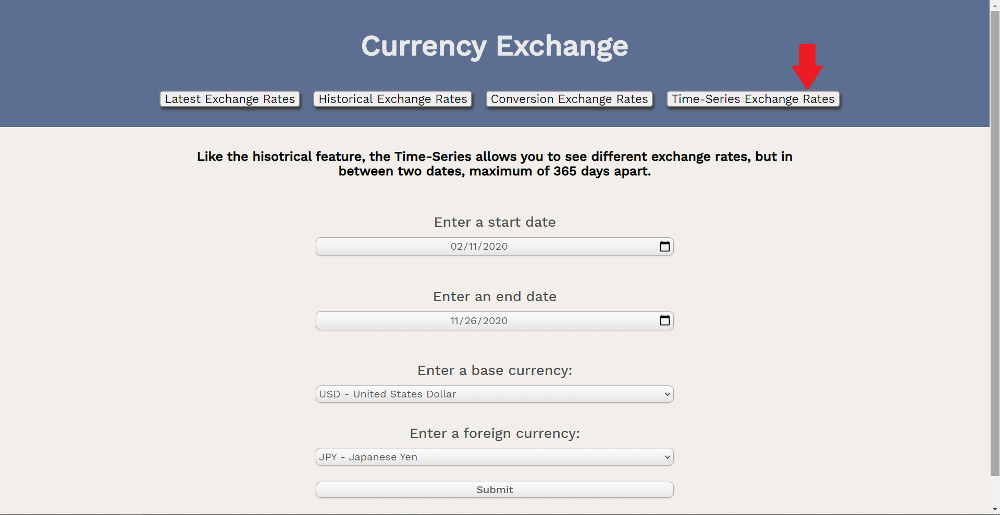

<h1>Currency Exchange API</h1>

A app that is useful for anyone to quickly see latest or historical currency exchange rates and convert any form of currency of their choosing.

Click <a href="https://edoardrui0.github.io/Foreign-Currency-Exchange-API/" target="_blank">here</a> to visit the site

<h2>Screenshots</h2>

This is the main page upon entering the website.

The first button, "Latest Exchange Rates", brings up two dropdown menus with a list of currencies and their respective countries/currency name. Enter two currencies to get the latest exchange rate between the two, updated every 10 minutes.

The second button, "Historical Exchange Rates", adds the feature of selecting a specific date (as far as May 31st, 2000) to see the exact exchange rate during those dates.

The third button, "Conversion Exchange Rates", accurately converts any number of base currency to a foreign currency

The fourth button, "Time-Series Exchange Rates", adds a feature similar to the historical feature, but you can input two dates to return a list of exchange rates between those currencies within those two dates, up to 365 days

<h2>Technologies Used</h2>
<ul>
  <li>HTML</li>
  <li>CSS</li>
  <li>JavaScript</li>
  <li>jQuery</li>
</ul>
