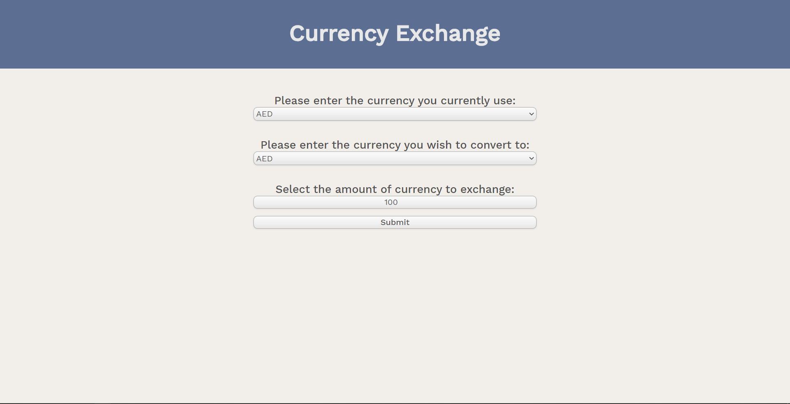
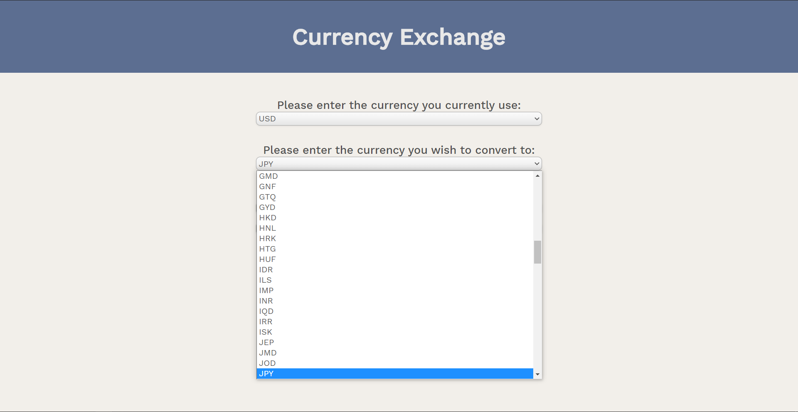
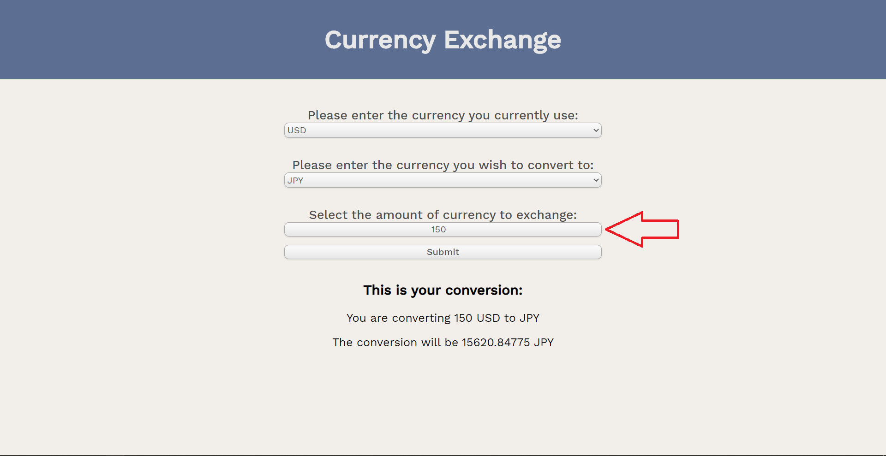

<h1>Currency Exchange API</h1>

A app that is useful for anyone to quickly see latest or historical currency exchange rates and convert any form of currency of their choosing.

Click <a href="https://edoardrui0.github.io/Foreign-Currency-Exchange-API/" target="_blank">here</a> to visit the site

<h2>Screenshots</h2>

This is the main page the user will see.

The user can change the type of currency by clicking the dropdown menu

After selecting their currency, the user can input how much of the 
first currency they want to exchange for, see the red arrow. After the user clicks submit,
a description at the bottom will appear, declaring what the exchange rate is.

<h2>Summary</h2>

When travelling to foreign countries, one usually does not know how much money they should take on the trip, or what will be the exchange rate. Thanks to the <a href="https://edoardrui0.github.io/Foreign-Currency-Exchange-API/" target="_blank">Foreign Currency Exchange</a> website, finding out the exact exchange rate has never been easier. Simply input the type of currency you use, whether its USD, JPY, gold or even BitCoin! Afterwards, input the currency you wish to exchange to. Then input the amount you wish to exchange and the API will happen the rest for you. It'll then accurately convert the currency for you. Enjoy your vacations!

<h2>Technologies Used</h2>
<ul>
  <li>HTML</li>
  <li>CSS</li>
  <li>JavaScript</li>
  <li>jQuery</li>
</ul>
